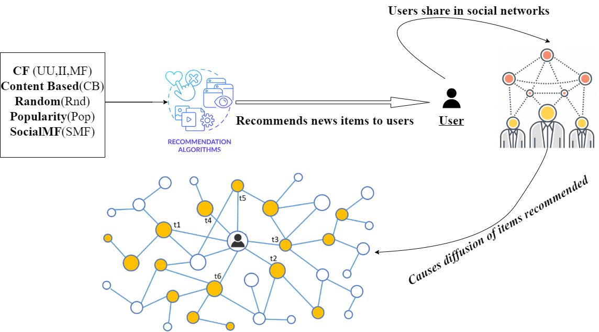

## Misinformation, Dissemination, & Recommendation Algorithms

Welcome to the GitHub repository for our research on "Understanding the Contribution of Recommendation Algorithms on Misinformation Recommendation and Misinformation Dissemination on Social Networks." This repository contains supplementary materials, additional experiment results, and information that complements our work.

<p align="center">
  
</p>

## Overview

In this research endeavor, we have delved into the intricate relationship between recommendation algorithms and the spread of misinformation. By developing a novel framework, we have integrated information diffusion models to meticulously analyze the impact of traditional recommender systems on the propagation of misleading news within social networks.

## Research Publication

Our work has been published in the [ACM Transactions on the Web (TWEB)](https://doi.org/10.1145/3616088) Journal. We invite you to explore the full publication to gain deeper insights into our methodology, findings, and conclusions.

## Citation
  If you discover that our work is beneficial for your research pursuits, we kindly request you to reference the subsequent paper:
  ```bibtex
  @article{10.1145/3616088,
author = {Pathak, Royal and Spezzano, Francesca and Pera, Maria Soledad},
title = {Understanding the Contribution of Recommendation Algorithms on Misinformation Recommendation and Misinformation Dissemination on Social Networks},
year = {2023},
issue_date = {November 2023},
publisher = {Association for Computing Machinery},
address = {New York, NY, USA},
volume = {17},
number = {4},
issn = {1559-1131},
url = {https://doi.org/10.1145/3616088},
doi = {10.1145/3616088},
abstract = {Social networks are a platform for individuals and organizations to connect with each other and inform, advertise, spread ideas, and ultimately influence opinions. These platforms have been known to propel misinformation. We argue that this could be compounded by the recommender algorithms that these platforms use to suggest items potentially of interest to their users, given the known biases and filter bubbles issues affecting recommender systems. While much has been studied about misinformation on social networks, the potential exacerbation that could result from recommender algorithms in this environment is in its infancy. In this manuscript, we present the result of an in-depth analysis conducted on two datasets (Politifact FakeNewsNet dataset and HealthStory FakeHealth dataset) in order to deepen our understanding of the interconnection between recommender algorithms and misinformation spread on Twitter. In particular, we explore the degree to which well-known recommendation algorithms are prone to be impacted by misinformation. Via simulation, we also study misinformation diffusion on social networks, as triggered by suggestions produced by these recommendation algorithms. Outcomes from this work evidence that misinformation does not equally affect all recommendation algorithms. Popularity-based and network-based recommender algorithms contribute the most to misinformation diffusion. Users who are known to be superspreaders are known to directly impact algorithmic performance and misinformation spread in specific scenarios. Findings emerging from our exploration result in a number of implications for researchers and practitioners to consider when designing and deploying recommender algorithms in social networks.},
journal = {ACM Trans. Web},
month = {oct},
articleno = {35},
numpages = {26},
keywords = {news, Misinformation, diffusion, recommendation algorithms, Twitter, social networks}
}
  ```


## Ethics Statement

This research project relies on publicly available Twitter data, which was initially collected and tagged by third parties. The data used in this research is publicly accessible and does not involve any user identity, nor is any user identity disclosed or utilized in the analysis. The focus of the research is on aggregated, anonymized data from the platform.
